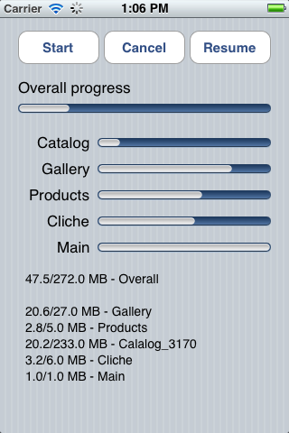

AsyncQueueDownload
==================

AsyncQueueDownload is a small example of how you may use ASIHTTPRequest and ASINetworkQueue to asynchronously download multiple files, track status of those downloads and resume interrupted downloads. Part of this example may be used as a simple wrapper around ASIHTTRequest classes. 

To start downloading files you need to initialise NSMutableDictionary *downloadStack with your file names and URLs and then pass it to downloadFiles: function. When a file is downloaded it is removed from the download stack. You get "ASIQueueDownloadCompleted" notification as soon as download stack is empty.

Files continue to download in the background and when the device is locked. If the internet connection is lost during the download then wrapper initialises NSTimer that resumes interrupted downloads as soon as internet connection (WiFi) is reestablished.

Another options:
- You might wanna set another custom notification that would tell you when each of the files are downloaded so that you can process them asynchronously too.